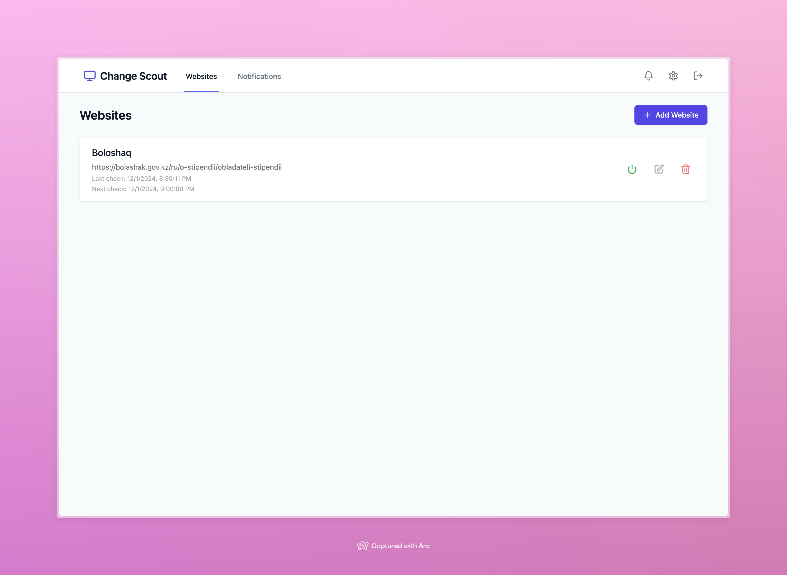

# ChangeScout

## 🌐 Website Monitoring Made Simple

ChangeScout is a powerful, open-source web monitoring tool that helps you track changes on websites with advanced customization and notification capabilities.


[](https://codecov.io/gh/gelleson/changescout)
## ✨ Key Features

### 🔍 Advanced Website Monitoring
- Track changes on any website
- Flexible scheduling with cron expressions
- Multiple monitoring modes (HTML, JSON)

### 🛠 Powerful Configuration
- Custom HTTP request settings
- Selective content extraction
- Advanced processing options:
   - Deduplication
   - Trimming
   - Sorting
   - CSS/JSON path selection

### 🔔 Comprehensive Notifications
- Multiple notification channels
- Currently supports Telegram
- Easy setup and configuration

### 🚀 Technical Highlights
- Microservice architecture
- GraphQL API
- Robust diff detection
- Scalable design

## 🖥 Tech Stack

### Backend
- Go 1.23
- GraphQL (gqlgen)
- SQLite
- Echo Framework
- Watermill for messaging
- JWT Authentication

### Frontend
- React
- TypeScript
- Tailwind CSS
- Apollo Client
- Vite

## 📦 Quick Start

### Prerequisites
- Go 1.23+
- Bun (for frontend)
- Docker (optional)

### Installation

1. Clone the repository
```bash
git clone https://github.com/gelleson/changescout.git
cd changescout
```

2. Set up environment
```bash
# Create .env file
cp .env.example .env

# Install backend dependencies
go mod download

# Install frontend dependencies
cd web && bun install
```

3. Run the application
```bash
# Start backend
just start

# Start frontend development
just dev
```

## 🔧 Configuration

ChangeScout offers extensive configuration options through:
- Environment variables
- CLI flags
- GraphQL API


## 🌈 Screenshots



## 🤝 Contributing

Contributions are welcome! Please see [CONTRIBUTING.md](CONTRIBUTING.md)

### Development Workflow
- Fork the repository
- Create a feature branch
- Write tests
- Ensure CI passes
- Submit a pull request

## 📄 License

[MIT](LICENSE.md)

## 🌟 Star History

No stars yet :(

## 💖 Support

If you find ChangeScout useful, consider:
- ⭐ Starring the repository
- �  Financial Support via GitHub Sponsors
- 🐛 Reporting issues
- 📝 Improving documentation
